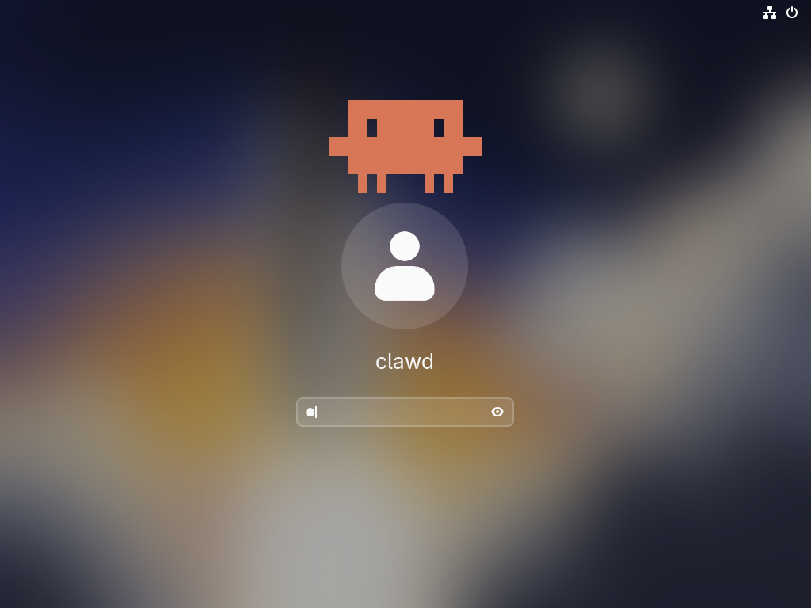
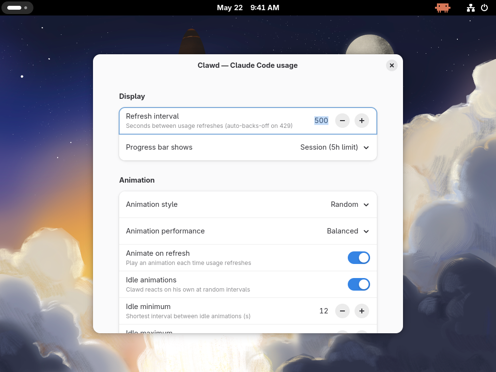

# Clawd — Claude Code usage mascot

Animated pixel-art mascot ([Clawd](https://www.claudeclawd.fun/)) that lives
in your panel and shows real-time Claude Code subscription usage — session %,
weekly %, extra credits — pulled from Anthropic's `/api/oauth/usage` endpoint
using your existing Claude Code OAuth token.

Two implementations sharing the same forms + animation library:

- **Cinnamon** — panel applet (GJS) + optional lock-screen widget (Python)
- **GNOME Shell 42–50** — top-bar extension (ESM build for 45+, legacy
  `imports` build for 42–44)

<p align="center">
  
  
</p>

## Features

- Real subscription usage from Anthropic (not theoretical API rates)
- Progress bar in popup menu: session / week / week-Sonnet / extra credits
- Auto-refresh every ~8 min with exponential back-off on HTTP 429
- "Last updated / next in X" live timestamps
- 22+ multi-color pixel-art forms (clawd, ghost, octopus, sparkle, blob,
  pacman, invader, crown, skull, mushroom, pokeball, kirby, snorlax, amongus,
  slime, penguin, jack_o_lantern, cat, gem, ufo, snowman, heart, …)
- Declarative animation DSL (bounce, wiggle, squish, shake, tilt, walk,
  excited, morph, glitch, wink, yawn, lookAround, rainbow, grow)
- Per-form palette + row count (chunky 6-row Clawd, fine 12-row newer forms)
- Animation playground in menu (Configure → Show animation playground)
- **Animation performance** setting — *Power saver / Balanced / Smooth* —
  trades CPU wakeups against frame rate; idle tick throttles automatically
- All animations skipped when the actor isn't on-screen (zero CPU)

**Cinnamon lock screen** (optional, fully user-space — no sudo):
- Same animations as panel
- Rare "grow" easter egg (Clawd briefly fills the screen)
- Random speech-bubble messages (memes / wisdom / jokes), editable from the
  applet settings ("Edit lock-screen messages…" button)
- Toggle on/off — auto-restarts screensaver

**GNOME lock screen:** Clawd appears on the unlock dialog (rotating speech
bubbles, configurable size, top/bottom position). Verified on GNOME 42 and 49.

## Install

Top-level entry point detects your desktop — and, on GNOME, picks the right
build from `gnome-shell --version`:

```bash
./install.sh                # interactive — asks what to install
./install.sh --auto         # install everything matching the detected DE
```

| Desktop            | Build           |
|--------------------|-----------------|
| Cinnamon           | `cinnamon/`     |
| GNOME Shell 45–50  | `gnome/` (ESM)  |
| GNOME Shell 42–44  | `gnome-legacy/` |

…or force a target / run a per-DE installer directly:

```bash
./install.sh --cinnamon --auto       # Cinnamon: applet + lock-screen widget
./install.sh --gnome --auto          # GNOME: auto-pick build by version
./install.sh --gnome-legacy --auto   # force the GNOME 42–44 build
./install.sh --gnome-modern --auto   # force the GNOME 45+ build
bash cinnamon/install.sh --applet    # just the Cinnamon panel applet
```

### After install

**Cinnamon:**
- Right-click the panel → Applets → enable "Clawd — Claude Code usage"
- For the lock-screen widget:
  `pkill -f /usr/share/cinnamon-screensaver/cinnamon-screensaver-main`
  (it auto-respawns and picks up the new widget on next lock)

**GNOME Shell (45+):**
- Log out + log back in, then `gnome-extensions enable clawd@rowdy4e`
- Open prefs: `gnome-extensions prefs clawd@rowdy4e`

## Architecture

```
clawd/
├── shared/                       # single source of truth — both
│   ├── forms.json                #   implementations install these
│   └── animations.json
├── cinnamon/
│   ├── applet/
│   │   ├── applet.js
│   │   ├── anim_runner.js        # DSL interpreter (GJS)
│   │   ├── settings-schema.json
│   │   └── fetch-usage.sh
│   ├── lockscreen/
│   │   ├── usercustomize.py      # site-customize hook (no sudo)
│   │   ├── clawd_widget_user.py
│   │   └── anim_runner.py        # DSL interpreter (Python)
│   └── install.sh
├── gnome/                        # GNOME Shell 45–50 (ESM)
│   ├── extension/
│   │   ├── extension.js
│   │   ├── anim_runner.js        # DSL interpreter (ES module)
│   │   ├── clawd-core.js         # loads forms.json + animations.json
│   │   ├── prefs.js
│   │   └── schemas/
│   └── install.sh
├── gnome-legacy/                 # GNOME Shell 42–44 (legacy imports)
│   ├── extension/                #   same logic, pre-45 module system
│   └── install.sh
├── assets/                       # README screenshots
└── install.sh                    # top-level: detects DE + GNOME version
```

`shared/forms.json` and `shared/animations.json` are the **canonical** data
files. Both install scripts copy them into their respective target directories
alongside the runtime code.

### Form data (`shared/forms.json`)

Each form declares its pixel art, color(s), and optional metadata:

```json
"snowman": {
  "color": [0.97, 0.97, 0.97],
  "palette": {
    "W": [0.97, 0.97, 0.97],
    "K": [0.05, 0.05, 0.05],
    "O": [0.95, 0.55, 0.10],
    "S": [0.85, 0.15, 0.15]
  },
  "pixels": [ "..", "....KKKKKKKKKK....", … ]
}
```

- `color` — default body color (used when no `palette` is set)
- `palette` — per-glyph colors; any non-`O/E/F/.` glyph in pixels picks here
- `rows` — optional, defaults to `pixels.length`. Per-form row count lets
  chunky Clawd stay 6-row while newer detailed forms can be 12+ rows
- `contexts` — optional `["panel"]` / `["lockscreen"]` to restrict where the
  form is available (e.g. HD lockscreen-only variants)
- `eye_row` / `mouth_row` / `pivot_row` — optional explicit positions

### Animation DSL (`shared/animations.json`)

Declarative tween scripts:

```json
"bounce": [
  {"tween": "body_y", "to": -10, "ms": 180, "ease": "ease_out_quad"},
  {"tween": "body_y", "to": 0,   "ms": 400, "ease": "ease_out_bounce"}
]
```

Primitives: `tween`, `tween_many`, `delay`, `set`, `repeat`, `sequence`,
`parallel`. Value generators: `random_pick`, `random_from`, `random_range`,
`iter_pick`, `ref`. Easter-egg tagging via top-level `tags` map.

### Cinnamon lock screen — no-sudo hook

`cinnamon-screensaver-main.py` is a regular Python script. We install
`usercustomize.py` into the user's site-packages so Python imports it at
startup. It checks `sys.argv[0]`, and if we're inside cinnamon-screensaver
it registers a meta-path finder that monkey-patches `Stage.setup_clawd` to
instantiate our `ClawdWidget`. For any other Python program the hook is a
no-op.

The applet writes lock-screen state to `~/.config/clawd-lockscreen/{enabled,messages}`.
A Gio.FileMonitor on `messages` restarts the screensaver when the user edits
the message list (button in applet settings).

## Requirements

- **Cinnamon** ≥ 6 OR **GNOME Shell** 42–50
- Python 3 + GTK 3 (already installed by Cinnamon — Cinnamon side only)
- A Claude Code session — credentials read from `~/.claude/.credentials.json`

The usage endpoint (`/api/oauth/usage`) is **unofficial** — the same one the
Claude Code CLI calls. Clawd only talks to `api.anthropic.com` with your own
token; nothing is sent to any third party. The endpoint may change without
notice.

## Distro compatibility

Works on any distribution that ships Cinnamon or GNOME Shell 42+. Tested on
Linux Mint 22.x (Cinnamon 6.6.7), Ubuntu 22.04 (GNOME 42.9), Fedora 43
(GNOME 49), and Ubuntu 26.04 (GNOME 50.1).

## Credits

- Created by [rowdy4e](https://github.com/rowdy4e).
- Designed and built in pair-programming with **Claude** ([Claude Code](https://claude.com/claude-code)),
  Anthropic's CLI coding agent — from the pixel-art renderer and animation DSL
  to the Cinnamon/GNOME ports and the GNOME 42 legacy build.

## License

[MIT](LICENSE) © rowdy4e
